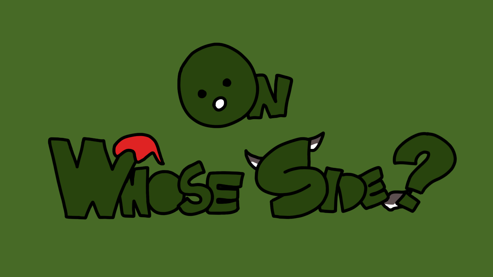
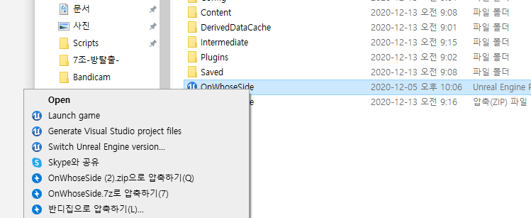
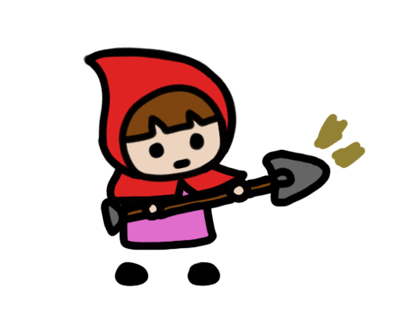
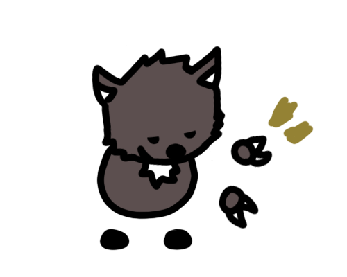
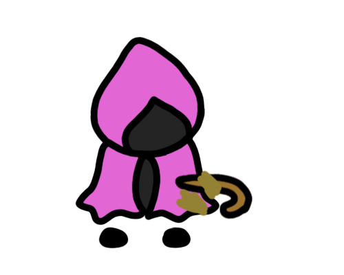
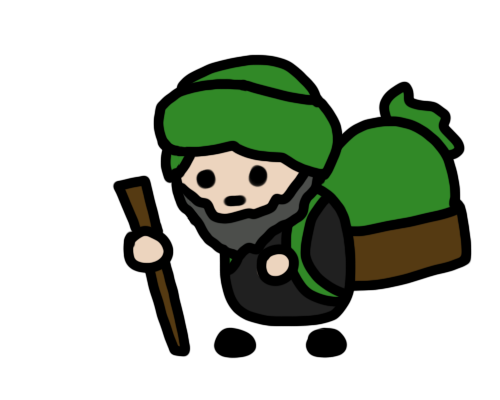
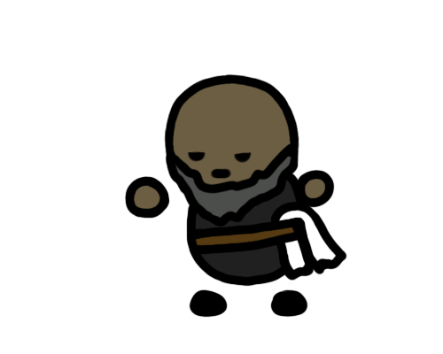
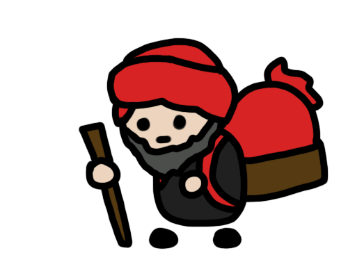
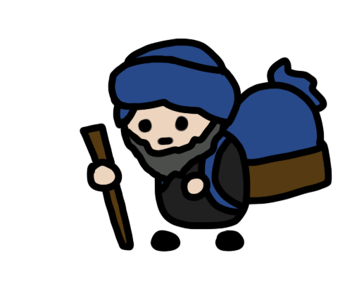

# OnWhoseSide
2020-2 게임PX디자인 프로젝트

</img>

**OnWhoseSide**는 다른 플레이어가 어떤 팀인지 알 수 없는 '빨간모자vs늑대'의 팀술래잡기 멀티플레이 게임입니다. (특정 이벤트에서만 피아식별이 가능함)
  

# 소개영상
- [소개영상 링크](https://youtu.be/46_cu-_8Zhc)
 

# 멀티플레이게임(MainGame) - 다운로드 및 실행
1. [다운로드 링크](https://drive.google.com/file/d/13nw_n8hRJnKJYjkftJxZBEu5yOul1XGy/view?usp=sharing)에서 실행파일을 다운로드 받습니다.
2. 스팀계정에 로그인합니다.
3. 에픽게임즈(언리얼)계정에 로그인합니다.
4. 파일을 우클릭한 상태에서 'Launch game'을 눌러 실행합니다. </img>
 

# 싱글플레이게임(TestGame) - 연습모드 다운로드
1. [다운로드 링크](https://drive.google.com/file/d/1yKH8SlB0oJSTq-BgL8BJpKaiJWM39fhF/view?usp=sharing)에서 실행파일을 다운로드 받습니다.
2. 테스트용 싱글플레이게임으로 게임 시작과 동시에 9개의 움직이지 않는 봇이 랜덤생성됩니다.
3. 아이템 파밍과 사용, 봇과의 상호작용, 어빌리티 강화와 상인과의 상호작용을 테스트해볼 수 있습니다.
 

# 조작방법
- 캐릭터 이동 - 방향키
- </img></img></img>아이템 파밍 - Shift (꾹 누르기)
- 아이템 선택 - Alt
- 아이템 사용 - Ctrl
- 어빌리티 강화 (상점에서 골드 사용) - SpaceBar
 

# 어빌리티 레벨
- 각 어빌리티마다 1~5의 레벨이 존재합니다.
- 각 어빌리티에 따른 상인이 존재하며 상인에게서 어빌리티 강화가 가능합니다.
- 어빌리티 강화 당 골드 차감 n->n+1(n골드)
1. </img></img>시야범위
2. </img></img>공격범위
3. </img></img>이동속도
4. </img></img>아이템파밍속도
 

# 아이템
- 맵 내에 무작위로 50개의 </img>아이템박스가 리스폰 됩니다.
- 하나의 아이템박스는 네 종류의 아이템 중 한가지를 가지고 있습니다.
1. </img>골드
2. </img>킬 - 3초 (공격범위 내의 다른 플레이어를 처치할 수 있습니다.) / 킬 사용도중 (파밍, 실드사용) 불가
3. </img>실드 - 3초 (다른 플레이어의 킬 아이템을 무효시킬 수 있습니다.) / 실드 사용도중 (파밍, 킬사용) 불가
4. </img>스캐너 - 8초 (시야범위 내의 다른 플레이어의 팀을 구별할 수 있습니다.)
 

# 게임규칙
1. 게임시작
- 총 플레이어의 수(4/6/8/10/12명)를 선택합니다.
- 게임 플레이 타이머(5/10/15/20분)를 선택합니다.
- 게임 시작 시 모든 플레이어가 반으로 나뉘어 랜덤하게 (빨간모자or늑대)팀을 형성합니다.
2. 게임플레이
- 다른 플레이어에게 킬을 당하면 10초 후 상대 팀으로 바뀌어 리스폰됩니다.
3. 게임종료
- 게임 플레이 타이머가 0이 되면 게임이 종료됩니다.
- (빨간모자or늑대)팀 중 한팀이 점령하게되면 게임이 종료됩니다.
4. 최종점수
- 생존점수 / 게임종료 시 모든 플레이어는 마지막으로 속해있던 팀 내에서 오래 생존해있던 순서대로 점수가 매겨집니다.
- 킬점수 / 게임플레이 도중 상대 팀을 킬할 시 가점, 아군 팀을 킬할 시 감점합니다.
